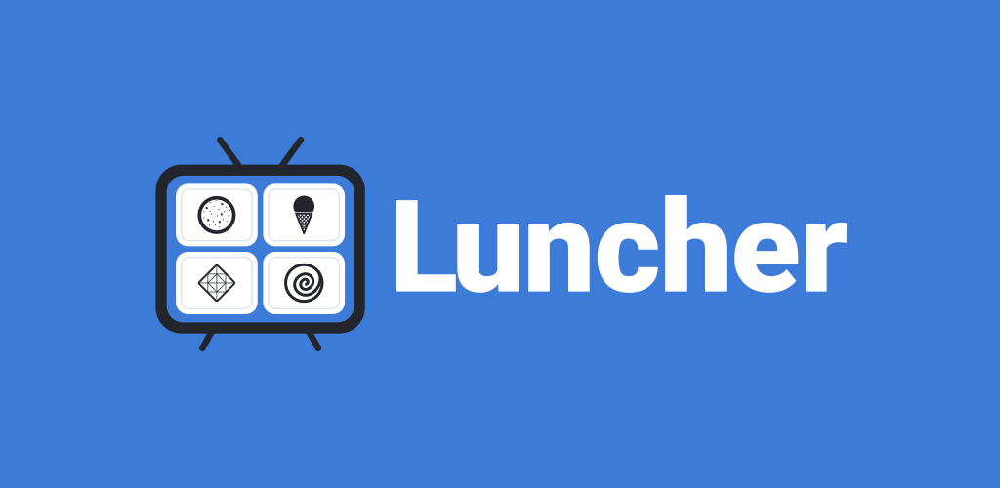
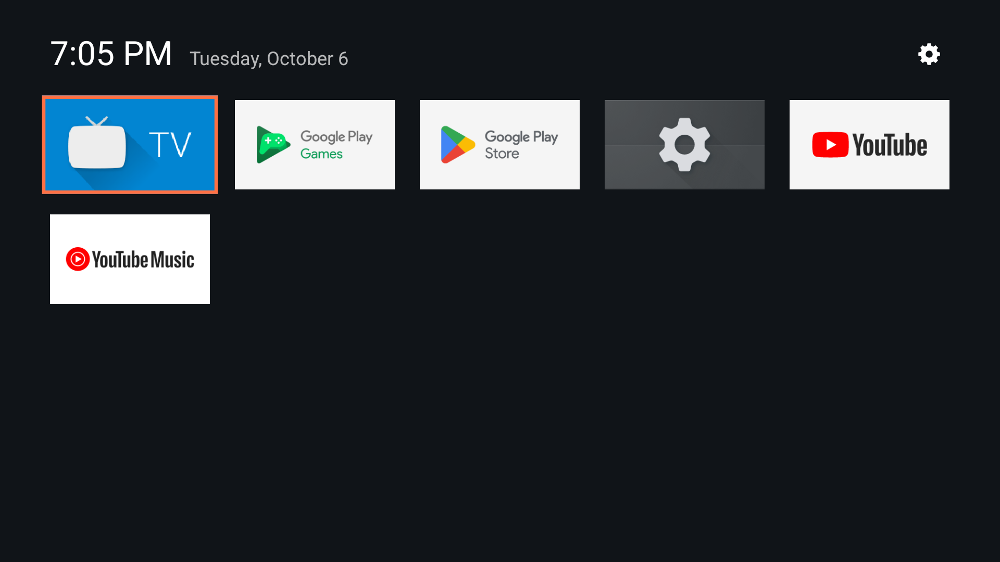
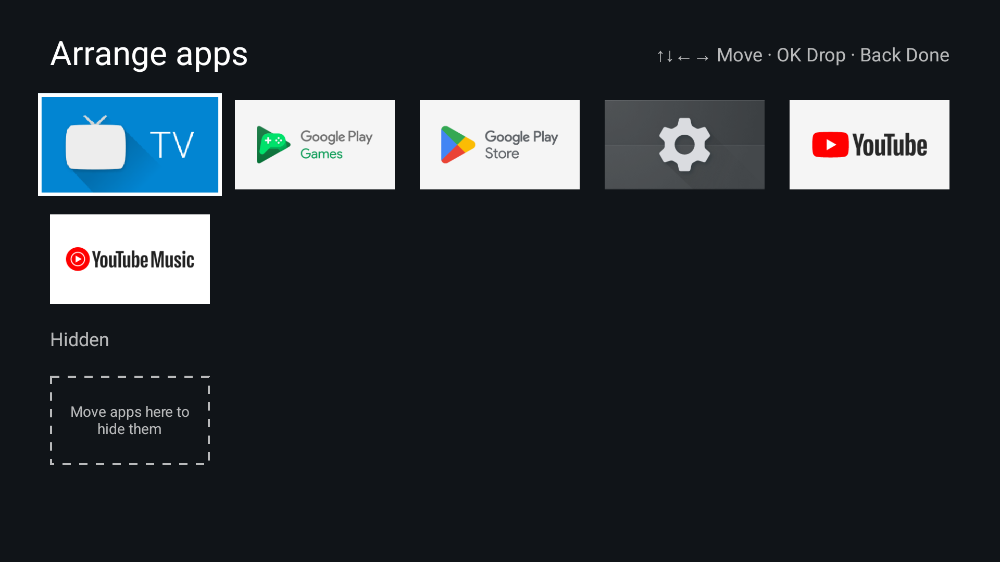
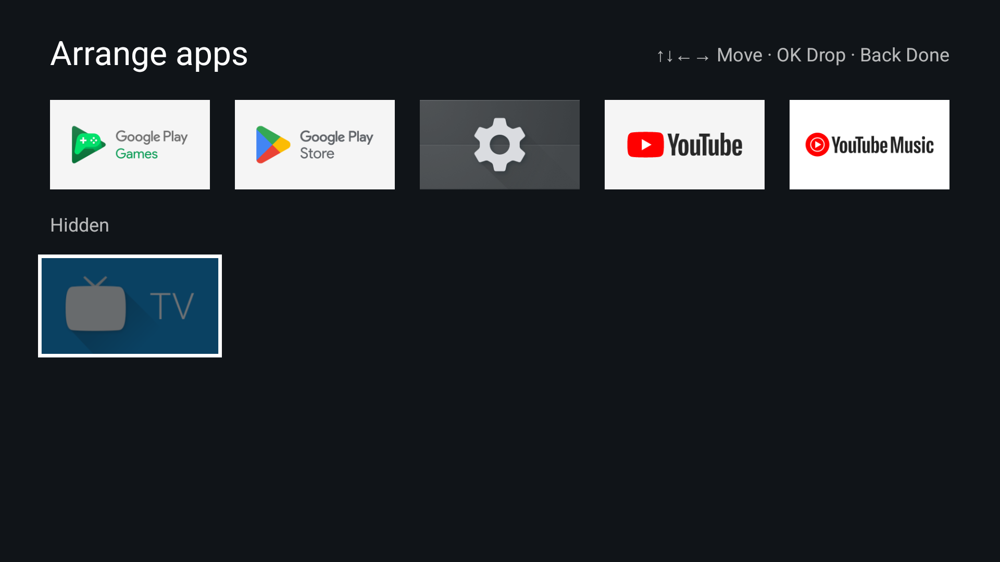
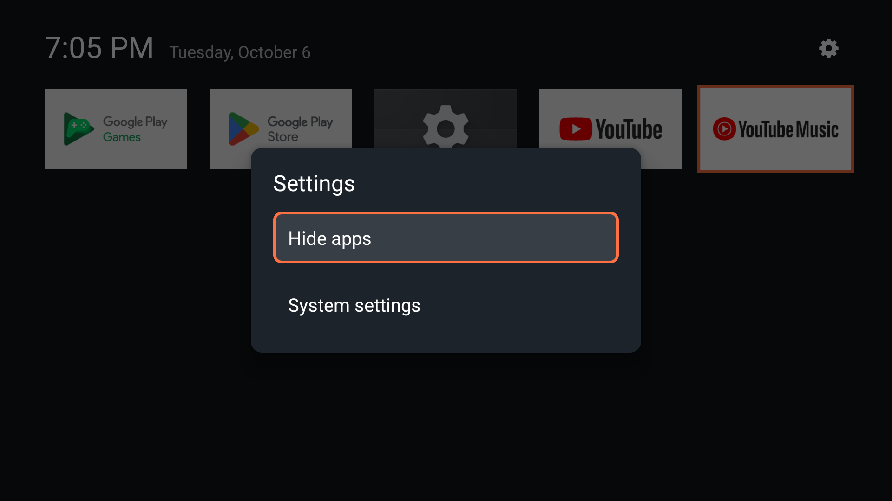

  

<b>A lightweight and customizable home screen for Android TV.</b>

It's made to run smoothly even on old and weak Android TV boxes, and designed with Amazon Fire TV
devices in mind.

## Screenshots

| | |
|---|---|
|  |  |
| Your apps, the time and the date | Hold OK on an app to move it |
|  |  |
| Move apps onto the shelf to hide them | Settings, a press away |

## Light by design

- Just a **~86 KB** APK to download.
- **Instant startup** and minimal memory usage.
- **No permissions and no internet:** no ads, no tracking, no accounts.
- **Runs on Android TV 5.1 and newer.**

## Features

**Ready**

- Your TV apps as a grid of banners, with the time and date
- Reorder apps: hold OK on an app, then move it
- Hide apps: move them onto the hidden shelf, or pick them from a list in the settings
- Settings from the gear or the Menu key, with a shortcut to the TV's own settings

**On the way**

- Your own banners for apps
- Your own wallpapers
- Appearance settings: tile size and spacing, colors and much more
- Wi-Fi, VPN and notifications in the status bar

## Install

Install the APK from [Releases](https://github.com/CVasilakis/luncher/releases) with `adb install`,
or with [Obtainium](https://github.com/ImranR98/Obtainium).
To use it as your home screen, make Luncher the default home app in your TV's system.

## For developers

How to build Luncher, how the code is organized, testing and releasing: [`docs/`](docs/README.md).

## License

Luncher is under the MIT License ([`LICENSE`](LICENSE)), except its icon and banner, the store
listing's images and the archived launch screen's graphics, which are derived from Android Open
Source Project artwork and are under the Apache License 2.0
([`app/README.md`](app/README.md#license)).
